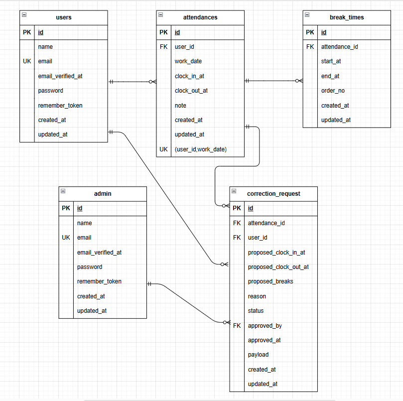

# 勤怠管理アプリ（Attendance Management App）

プロジェクト概要

本アプリは、スクールの模擬案件課題として作成したWEBアプリです。

Laravel・Fortify・Dockerを用いた勤怠管理システムの実装を目的としています。  
一般ユーザーと管理者の2権限を持ち、勤怠登録・修正申請・承認までを一連で管理できます。

## 開発環境
| 項目 | 内容　|
|:----:|:----:| 
 フレームワーク |	Laravel 10
 言語 |	PHP 8.4.4
 データベース |	MySQL 8.0.43
 環境構築 |	Docker/Docker Compose
 Webサーバー |	Nginx 1.21
 メール環境 |	Mailhog
 管理ツール |	phpMyAdmin（http://localhost:8080）

## 使用技術
|分類|技術|
|:--:|:--:|
 認証機能|	Laravel Fortify
 メール送信|	Mailhog（SMTP / 開発環境用）
 バリデーション|	FormRequest クラス
 DB操作|	Eloquent ORM
 テンプレート|	Blade
 テスト|	PHPUnit（Feature Test）
 デザイン|	CSS（ブロック形式／レスポンシブ対応）
 その他|	Seeder による初期データ登録

## 環境構築
### dockerビルド

1. リポジトリのクローン

   `git clone https://github.com/tomo1583gh/attendance-management.git`

2. 階層を変更

    `cd attendance-management`

3. Dockerコンテナのビルド・起動

    `docker-compose up -d --build`

    ※  MySQLは、OSによって起動しない場合があるのでそれぞれのPCに合わせてdocker-compose.ymlファイルを編集して下さい。

### Laravelセットアップ

1. PHPコンテナに入る

    `docker-compose exec php bash`

2. Composerで依存パッケージをインストール

    `composer install`

3. .envファイルを作成

    `cp .env.example .env`

    必要に応じて環境変数を編集

4. アプリケーションキーを生成

    `php artisan key:generate`

5. マイグレーションを実行

    `php artisan migrate`

6. 初期データを投入

    `php artisan db:seed`

7. Mailhog起動（別途インストール必要）

    http://localhost:8025 にアクセスし、送信メールを確認出来ます  
    `.env`のMAIL_HOST=mailhogを設定してください

8. ブラウザでアプリにアクセス

    `http://localhost`

### ⚠️ 権限エラーが発生する場合

WSL や Docker 環境で .env ファイルを編集・保存する際に、
以下のようなエラーが出ることがあります。

`EACCES: permission denied, open '/home/ユーザー名/.../.env'`

これは .env の所有者または権限が root になっており、
VSCode など通常ユーザーで書き込みできない状態です。

#### 対処方法

プロジェクト直下で以下を実行してください。

.env の所有者を自分に変更
`sudo chown $(whoami):$(whoami) .env`

書き込み権限を付与
`chmod 664 .env`

同様のエラーが他のファイルでも発生する場合は、
以下を実行して全ファイルの所有者を自分に戻します。

`sudo chown -R $(whoami):$(whoami) .`

#### 主な原因

- sudo コマンドで .env を作成または編集した

- コンテナ内（root権限）で .env を生成した

- storage/ や bootstrap/cache の権限が root になっている

#### 再発防止策

- .env は WSL 側で cp .env.example .env として作成する

- sudo は極力使わず、通常ユーザーで作業する

- 権限のリセットを定期的に実行

`sudo chown -R $(whoami):$(whoami) storage bootstrap/cache`
`chmod -R 775 storage bootstrap/cache`

## URL
| サービス | URL |
|:--------:|:-----:|
| 開発環境 | http://localhost:8000 |
| phpMyAdmin | http://localhost:8080 |
| Mailhog | http://localhost:8025 |

## 認証機能（Fortify）
一般ユーザー

1. /register から会員登録

2. 登録メール内リンクでメール認証

3. 認証後、自動的に /attendance へ遷移

管理者

1. ログインURL：/admin/login

2. 認証後、勤怠一覧画面（/admin/attendances）へ遷移

## テストユーザーについて

アプリ起動後、Seederにより自動でテストユーザーが作成されます  
ログインや購入機能の動作確認にご利用ください

### ログイン情報（ダミーユーザー）

一般ユーザー
- メールアドレス：user@example.com  
- パスワード：password

管理者
- メールアドレス：admin@example.com
- パスワード：password

## 主な機能一覧
### 一般ユーザー側

- 会員登録・メール認証	Fortify＋Mailhog により確認メール送信
- ログイン／ログアウト	セッション管理
- 出勤／休憩／退勤登録	休憩は複数記録可能（break_timesテーブル）
- 勤怠一覧	月単位で出勤・退勤時刻を表示
- 勤怠詳細	当日の詳細表示・修正申請可能
- 修正申請	申請理由・修正時刻を送信（承認待ち状態）
- 申請一覧	承認待ち／承認済みタブ切替対応
### 管理者側

- ログイン	Fortifyによる管理者専用認証
- 日別勤怠一覧	全スタッフの勤怠を日別表示
- 勤怠詳細編集	出退勤・休憩時間・備考を修正可
- 修正申請一覧	「承認待ち」「承認済み」切替可能
- 修正申請承認	勤怠反映処理・承認者記録
- スタッフ一覧	登録ユーザー一覧表示
- スタッフ別勤怠	各スタッフの月別勤怠を参照可能

## テーブル構成

主要テーブルは以下の通りです：

- users（一般ユーザー）

- admins（管理者）

- attendances（勤怠）

- break_times（休憩時間）

- correction_requests（修正申請）

## ER図

## テスト実行
`docker compose exec php php artisan test`

- Feature テスト：ユーザー／管理者それぞれの勤怠登録・修正・承認フローを検証

- FormRequest バリデーションを含む主要シナリオを自動テスト化済み

## ライセンス

このプロジェクトは学習目的の模擬案件として作成されたものです。
商用利用・再配布はご遠慮ください。